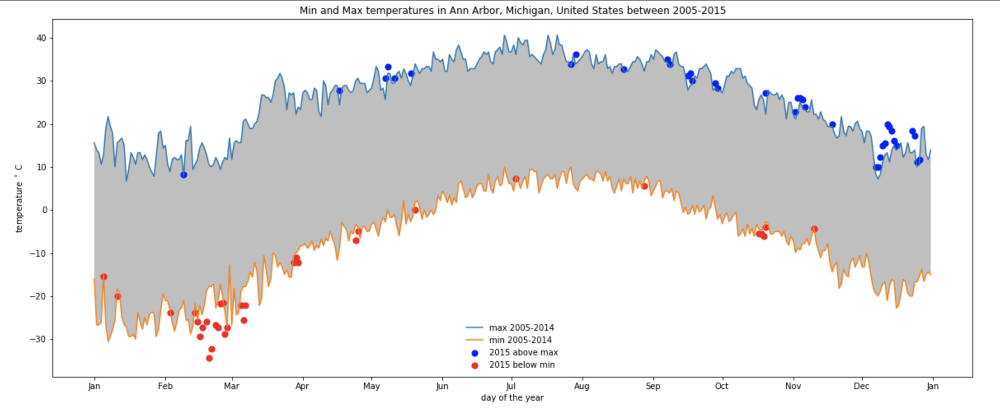

## PROMPT
# Upload an image of your record highs and lows plot. Ensure that your plot includes the following elements: 

an accurate title

correctly labelled axes

line graph displaying record highs and lows for 2005-2014

shaded area between the two lines

overlaid scatter plot indicates days in 2015 that broke a record high or low for 2005-2014

a legend or sufficient labelling for the line graph and scatter plot 

## Min and Max temperatures in Ann Arbor, Michigan, United States between 2005-2015
## Min and Max temperatures in Ann Arbor, Michigan, United States between 2005-2015

## PROMPT
# Describe how your visual leverages the guidelines of effective visual design outlined in module one of this course.

## The x-axis and y-axis is proper labelled, with unit. The y-axis is scaled to degree Celcius for readability. Comparison of 2015 versus 2005-2014 is using line and scatter respectively to be more visualised.

## PROMPT
# Please upload your source code.

## Module 2 Basic Charting Assignment 2 source code
## Module 2 Basic Charting Assignment 2 source code

